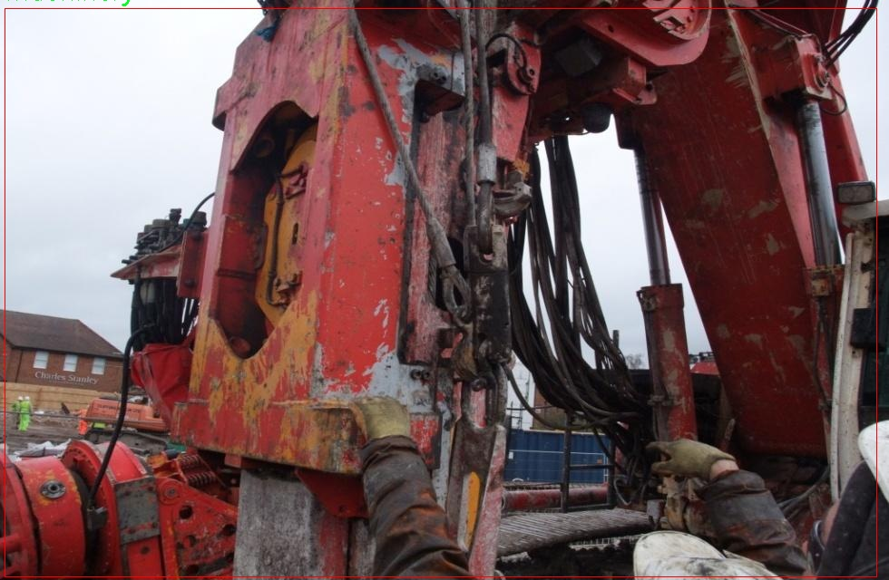

### 1.背景意义

研究背景与意义

随着城市化进程的加快，建筑工地的管理与安全问题日益凸显。建筑工地不仅是施工的重要场所，也是潜在的安全隐患聚集地，工地上存在着多种复杂的物体和设备，这些物体的识别与监测对于保障施工安全、提高工作效率具有重要意义。近年来，计算机视觉技术的迅猛发展为建筑工地的物体检测提供了新的解决方案。尤其是基于深度学习的目标检测算法，如YOLO（You Only Look Once）系列，因其高效的实时检测能力和较高的准确率，逐渐成为该领域的研究热点。

本研究旨在基于改进的YOLOv11算法，构建一个高效的建筑工地场景物体检测系统。该系统将利用一个包含39个类别的建筑工地数据集，涵盖了从混凝土、机械设备到施工人员等多种物体。这些类别的多样性不仅能够反映建筑工地的复杂性，还能为系统的训练提供丰富的样本数据。数据集中共包含922张经过标注的图像，采用YOLOv8格式进行标注，确保了数据的标准化和可用性。

通过对该数据集的深入分析与处理，研究将重点关注如何提升YOLOv11在建筑工地场景中的检测精度与速度，解决现有算法在复杂环境下的局限性。此外，研究还将探讨如何利用改进的算法实现对施工现场的实时监控与预警，进而为建筑行业的安全管理提供科学依据和技术支持。通过这一研究，期望能够推动建筑工地智能化管理的发展，提高施工安全性，降低事故发生率，最终实现建筑行业的可持续发展。

### 2.视频效果

[2.1 视频效果](https://www.bilibili.com/video/BV15cBeYREKD/)

### 3.图片效果


##### [项目涉及的源码数据来源链接](https://kdocs.cn/l/cszuIiCKVNis)**

注意：本项目提供训练的数据集和训练教程,由于版本持续更新,暂不提供权重文件（best.pt）,请按照6.训练教程进行训练后实现上图演示的效果。

### 4.数据集信息

##### 4.1 本项目数据集类别数＆类别名

nc: 39
names: ['Concrete', 'Loader', 'aerial view of construction site', 'bore pile', 'building structure', 'cables', 'car', 'concrete mixer truck', 'contiguous pile', 'continuous flight auger drill', 'crane', 'dump truck', 'excavator', 'exposed piles', 'floor', 'folded piling rig', 'hydraulic grab', 'hydrofraise cutter', 'load carrying crane', 'machinery', 'person with PPE', 'person', 'pile cage', 'pile casing', 'piling rig', 'pipeline', 'roller', 'secant pile', 'sectional flight auger', 'soil', 'steel', 'stone', 'testing equipment', 'truck', 'underground pipeline', 'underground tunnel', 'wall', 'water body', 'water']


该项目为【目标检测】数据集，请在【训练教程和Web端加载模型教程（第三步）】这一步的时候按照【目标检测】部分的教程来训练

##### 4.2 本项目数据集信息介绍

本项目数据集信息介绍

本项目所使用的数据集专注于建筑工地场景的物体检测，旨在通过改进YOLOv11算法，提高建筑工地环境中各类物体的识别精度与效率。该数据集包含39个类别，涵盖了建筑工地中常见的物体和设备，具体类别包括混凝土、装载机、建筑工地的鸟瞰图、钻孔桩、建筑结构、电缆、汽车、混凝土搅拌车、连续桩、连续飞行螺旋钻、起重机、自卸卡车、挖掘机、裸露桩、地面、折叠桩机、液压抓斗、水下切割机、载重起重机、机械设备、佩戴个人防护装备的人、普通人、桩笼、桩套、打桩机、管道、压路机、交错桩、截面飞行螺旋钻、土壤、钢材、石材、测试设备、卡车、地下管道、地下隧道、墙体、水体及水等。

这些类别的选择充分考虑了建筑工地的多样性和复杂性，能够有效反映出工地上各类物体的分布和特征。数据集中的图像来源于多个实际建筑工地，涵盖了不同的地理位置和施工阶段，确保了数据的多样性和代表性。此外，数据集中的每个图像均经过精确标注，以便于训练模型时能够准确识别和分类各类物体。这种高质量的标注不仅提升了模型的学习效果，也为后续的测试和评估提供了可靠的基础。

通过使用该数据集，研究团队期望能够训练出一种更加智能化的物体检测系统，不仅能够在建筑工地中实时监测和识别各类物体，还能为施工安全管理、资源调配及施工进度监控提供有力支持。最终目标是实现建筑工地的智能化管理，提高施工效率和安全性。




### 5.全套项目环境部署视频教程（零基础手把手教学）

[5.1 所需软件PyCharm和Anaconda安装教程（第一步）](https://www.bilibili.com/video/BV1BoC1YCEKi/?spm_id_from=333.999.0.0&vd_source=bc9aec86d164b67a7004b996143742dc)


[5.2 安装Python虚拟环境创建和依赖库安装视频教程（第二步）](https://www.bilibili.com/video/BV1ZoC1YCEBw?spm_id_from=333.788.videopod.sections&vd_source=bc9aec86d164b67a7004b996143742dc)

### 6.改进YOLOv11训练教程和Web_UI前端加载模型教程（零基础手把手教学）

[6.1 改进YOLOv11训练教程和Web_UI前端加载模型教程（第三步）](https://www.bilibili.com/video/BV1BoC1YCEhR?spm_id_from=333.788.videopod.sections&vd_source=bc9aec86d164b67a7004b996143742dc)


按照上面的训练视频教程链接加载项目提供的数据集，运行train.py即可开始训练



     Epoch   gpu_mem       box       obj       cls    labels  img_size
     1/200     20.8G   0.01576   0.01955  0.007536        22      1280: 100%|██████████| 849/849 [14:42<00:00,  1.04s/it]
               Class     Images     Labels          P          R     mAP@.5 mAP@.5:.95: 100%|██████████| 213/213 [01:14<00:00,  2.87it/s]
                 all       3395      17314      0.994      0.957      0.0957      0.0843

     Epoch   gpu_mem       box       obj       cls    labels  img_size
     2/200     20.8G   0.01578   0.01923  0.007006        22      1280: 100%|██████████| 849/849 [14:44<00:00,  1.04s/it]
               Class     Images     Labels          P          R     mAP@.5 mAP@.5:.95: 100%|██████████| 213/213 [01:12<00:00,  2.95it/s]
                 all       3395      17314      0.996      0.956      0.0957      0.0845

     Epoch   gpu_mem       box       obj       cls    labels  img_size
     3/200     20.8G   0.01561    0.0191  0.006895        27      1280: 100%|██████████| 849/849 [10:56<00:00,  1.29it/s]
               Class     Images     Labels          P          R     mAP@.5 mAP@.5:.95: 100%|███████   | 187/213 [00:52<00:00,  4.04it/s]
                 all       3395      17314      0.996      0.957      0.0957      0.0845


###### [项目数据集下载链接](https://kdocs.cn/l/cszuIiCKVNis)

### 7.原始YOLOv11算法讲解


##### YOLO11介绍

Ultralytics YOLO11是一款尖端的、最先进的模型，它在之前YOLO版本成功的基础上进行了构建，并引入了新功能和改进，以进一步提升性能和灵活性。
**YOLO11设计快速、准确且易于使用，使其成为各种物体检测和跟踪、实例分割、图像分类以及姿态估计任务的绝佳选择。**


**结构图如下：**


##### **C3k2**

**C3k2，结构图如下**


**C3k2，继承自类`C2f，其中通过c3k设置False或者Ture来决定选择使用C3k还是`**Bottleneck


**实现代码** **ultralytics/nn/modules/block.py**

##### C2PSA介绍

**借鉴V10 PSA结构，实现了C2PSA和C2fPSA，最终选择了基于C2的C2PSA（可能涨点更好？）**


**实现代码** **ultralytics/nn/modules/block.py**

##### Detect介绍

**分类检测头引入了DWConv（更加轻量级，为后续二次创新提供了改进点），结构图如下（和V8的区别）：**


### 8.200+种全套改进YOLOV11创新点原理讲解

#### 8.1 200+种全套改进YOLOV11创新点原理讲解大全

由于篇幅限制，每个创新点的具体原理讲解就不全部展开，具体见下列网址中的改进模块对应项目的技术原理博客网址【Blog】（创新点均为模块化搭建，原理适配YOLOv5~YOLOv11等各种版本）

[改进模块技术原理博客【Blog】网址链接](https://gitee.com/qunmasj/good)


#### 8.2 精选部分改进YOLOV11创新点原理讲解

###### 这里节选部分改进创新点展开原理讲解(完整的改进原理见上图和[改进模块技术原理博客链接](https://gitee.com/qunmasj/good)【如果此小节的图加载失败可以通过CSDN或者Github搜索该博客的标题访问原始博客，原始博客图片显示正常】


### HRNet V2简介
现在设计高低分辨率融合的思路主要有以下四种：


（a）对称结构。如U-Net、Hourglass等，都是先下采样再上采样，上下采样过程对称。

（b）级联金字塔。如refinenet等，高低分辨率融合时经过卷积处理。

（c）简单的baseline，用转职卷积进行上采样。

（d）扩张卷积。如deeplab等，增大感受野，减少下采样次数，可以无需跳层连接直接进行上采样。

（b）（c）都是使用复杂一些的网络进行下采样（如resnet、vgg），再用轻量级的网络进行上采样。

HRNet V1是在（b）的基础上进行改进，从头到尾保持大的分辨率表示。然而HRNet V1仅是用在姿态估计领域的，HRNet V2对它做小小的改进可以使其适用于更广的视觉任务。这一改进仅仅增加了较小的计算开销，但却提升了较大的准确度。

#### 网络结构图：


这个结构图简洁明了就不多介绍了，首先图2的输入是已经经过下采样四倍的feature map，横向的conv block指的是basicblock 或 bottleblock，不同分辨率之间的多交叉线部分是multi-resolution convolution（多分辨率组卷积）。

到此为止HRNet V2和HRNet V1是完全一致的。

区别之处在于这个基网络上加的一个head：


图3介绍的是接在图2最后的head。（a）是HRNet V1的头，很明显他只用了大分辨率的特征图。（b）（c）是HRNet V2的创新点，（b）用与语义分割，（c）用于目标检测。除此之外作者还在实验部分介绍了用于分类的head，如图4所示。


#### 多分辨率block：


一个多分辨率block由多分辨率组卷积（a）和多分辨率卷积（b）组成。（c）是一个正常卷积的展开，（b）的灵感来源于（c）。代码中（a）部分由Bottleneck和BasicBlock组成。

多分辨率卷积和正常卷积的区别：（1）多分辨率卷积中，每个通道的subset的分辨率都不一样。（2）通道之间的连接如果是降分辨率，则用的是3x3的2stride的卷积，如果是升分辨率，用的是双线性最邻近插值上采样。


### 9.系统功能展示

图9.1.系统支持检测结果表格显示

  图9.2.系统支持置信度和IOU阈值手动调节

  图9.3.系统支持自定义加载权重文件best.pt(需要你通过步骤5中训练获得)

  图9.4.系统支持摄像头实时识别

  图9.5.系统支持图片识别

  图9.6.系统支持视频识别

  图9.7.系统支持识别结果文件自动保存

  图9.8.系统支持Excel导出检测结果数据


### 10. YOLOv11核心改进源码讲解

#### 10.1 val.py

以下是经过精简和注释的核心代码部分，主要保留了 YOLO 检测验证器的核心功能，并对每个重要部分进行了详细的中文注释：

```python
import os
import torch
from ultralytics.engine.validator import BaseValidator
from ultralytics.utils.metrics import DetMetrics, ConfusionMatrix
from ultralytics.utils import ops

class DetectionValidator(BaseValidator):
    """
    基于检测模型的验证器类，继承自 BaseValidator。
    """

    def __init__(self, dataloader=None, save_dir=None, args=None):
        """初始化检测模型所需的变量和设置。"""
        super().__init__(dataloader, save_dir, args)
        self.metrics = DetMetrics(save_dir=self.save_dir)  # 初始化检测指标
        self.confusion_matrix = ConfusionMatrix(nc=len(args.names))  # 初始化混淆矩阵

    def preprocess(self, batch):
        """预处理图像批次以进行 YOLO 训练。"""
        batch["img"] = batch["img"].to(self.device) / 255  # 将图像数据归一化
        for k in ["batch_idx", "cls", "bboxes"]:
            batch[k] = batch[k].to(self.device)  # 将标签和边界框移动到设备上
        return batch

    def postprocess(self, preds):
        """对预测输出应用非极大值抑制（NMS）。"""
        return ops.non_max_suppression(
            preds,
            self.args.conf,
            self.args.iou,
            multi_label=True,
            max_det=self.args.max_det,
        )

    def update_metrics(self, preds, batch):
        """更新检测指标。"""
        for si, pred in enumerate(preds):
            pbatch = self._prepare_batch(si, batch)  # 准备当前批次的数据
            cls, bbox = pbatch.pop("cls"), pbatch.pop("bbox")  # 获取当前批次的真实标签和边界框
            if len(pred) == 0:  # 如果没有检测到目标
                continue
            
            predn = self._prepare_pred(pred, pbatch)  # 准备预测数据
            self.confusion_matrix.process_batch(predn, bbox, cls)  # 更新混淆矩阵
            self.metrics.process(predn, bbox, cls)  # 更新指标

    def get_stats(self):
        """返回指标统计信息和结果字典。"""
        stats = self.metrics.results_dict  # 获取当前的指标结果
        return stats

    def print_results(self):
        """打印每个类别的训练/验证集指标。"""
        LOGGER.info(f"Results: {self.metrics.mean_results()}")  # 打印平均结果

    def _prepare_batch(self, si, batch):
        """准备当前批次的图像和注释。"""
        idx = batch["batch_idx"] == si
        cls = batch["cls"][idx].squeeze(-1)  # 获取当前批次的类别
        bbox = batch["bboxes"][idx]  # 获取当前批次的边界框
        return dict(cls=cls, bbox=bbox)

    def _prepare_pred(self, pred, pbatch):
        """准备预测数据。"""
        predn = pred.clone()  # 克隆预测数据
        return predn  # 返回处理后的预测数据
```

### 代码说明：
1. **类的定义**：`DetectionValidator` 类用于验证 YOLO 模型的检测性能，继承自 `BaseValidator`。
2. **初始化方法**：`__init__` 方法中初始化了一些重要的变量，包括检测指标和混淆矩阵。
3. **预处理方法**：`preprocess` 方法用于将输入图像归一化并将数据移动到指定设备（如 GPU）。
4. **后处理方法**：`postprocess` 方法应用非极大值抑制，以过滤掉重叠的检测框。
5. **更新指标**：`update_metrics` 方法用于更新检测指标，包括处理预测结果和真实标签。
6. **获取统计信息**：`get_stats` 方法返回当前的指标统计信息。
7. **打印结果**：`print_results` 方法用于打印每个类别的检测结果。
8. **批次准备**：`_prepare_batch` 和 `_prepare_pred` 方法用于准备当前批次的真实标签和预测数据。

通过这些核心部分的保留和注释，可以更好地理解 YOLO 检测验证器的工作原理。

这个文件 `val.py` 是一个用于YOLO（You Only Look Once）目标检测模型验证的实现。它主要通过继承 `BaseValidator` 类来扩展验证功能。该文件的核心是 `DetectionValidator` 类，它负责处理验证过程中的各种任务，包括数据预处理、模型评估、结果输出等。

在初始化时，`DetectionValidator` 类接收数据加载器、保存目录、参数等信息，并设置了一些必要的变量和状态，包括是否使用COCO数据集、类别映射、任务类型等。它还初始化了一些评估指标，如检测指标和混淆矩阵。

`preprocess` 方法用于对输入的图像批次进行预处理，包括将图像数据转换为适合YOLO模型的格式，并进行归一化处理。同时，如果设置了混合保存选项，还会准备用于自动标注的数据。

`init_metrics` 方法则用于初始化评估指标，包括确定验证数据集的路径、是否为COCO数据集、类别名称等信息。它还会根据模型的类别数量设置混淆矩阵。

在验证过程中，`postprocess` 方法会对模型的预测结果应用非极大值抑制（NMS），以减少冗余的检测框。`update_metrics` 方法负责更新检测指标，包括处理每个批次的预测结果和真实标签，并计算相关的统计信息。

`finalize_metrics` 方法在验证结束时设置最终的指标值，而 `get_stats` 方法则用于返回计算得到的统计信息和结果字典。

此外，`print_results` 方法用于打印每个类别的验证结果，包括图像数量、实例数量和各类指标。它还会绘制混淆矩阵以可视化模型的分类性能。

文件中还包含了一些辅助方法，如 `build_dataset` 和 `get_dataloader` 用于构建数据集和数据加载器，`plot_val_samples` 和 `plot_predictions` 用于可视化验证样本和预测结果，`save_one_txt` 和 `pred_to_json` 用于将检测结果保存为文本文件或JSON格式。

最后，`eval_json` 方法用于评估YOLO模型在COCO格式下的输出，并返回性能统计信息，利用 `pycocotools` 库计算mAP（平均精度均值）等指标。

整体来看，这个文件实现了YOLO模型验证的完整流程，涵盖了从数据预处理到结果评估的各个环节，旨在为用户提供一个高效、可扩展的目标检测验证工具。

#### 10.2 predict.py

以下是经过简化和注释的核心代码部分：

```python
# 导入必要的模块
from ultralytics.engine.predictor import BasePredictor
from ultralytics.engine.results import Results
from ultralytics.utils import ops

class DetectionPredictor(BasePredictor):
    """
    DetectionPredictor类，继承自BasePredictor，用于基于检测模型进行预测。
    """

    def postprocess(self, preds, img, orig_imgs):
        """
        对预测结果进行后处理，并返回Results对象的列表。

        参数:
        preds: 模型的预测结果
        img: 输入图像
        orig_imgs: 原始图像（可能是torch.Tensor或numpy数组）

        返回:
        results: 包含后处理结果的Results对象列表
        """
        # 应用非极大值抑制（NMS）来过滤预测框
        preds = ops.non_max_suppression(
            preds,
            self.args.conf,  # 置信度阈值
            self.args.iou,   # IOU阈值
            agnostic=self.args.agnostic_nms,  # 是否使用类别无关的NMS
            max_det=self.args.max_det,  # 最大检测框数量
            classes=self.args.classes,    # 过滤的类别
        )

        # 如果输入的原始图像不是列表，则将其转换为numpy数组
        if not isinstance(orig_imgs, list):
            orig_imgs = ops.convert_torch2numpy_batch(orig_imgs)

        results = []  # 初始化结果列表
        for i, pred in enumerate(preds):
            orig_img = orig_imgs[i]  # 获取对应的原始图像
            # 将预测框的坐标缩放到原始图像的尺寸
            pred[:, :4] = ops.scale_boxes(img.shape[2:], pred[:, :4], orig_img.shape)
            img_path = self.batch[0][i]  # 获取图像路径
            # 创建Results对象并添加到结果列表
            results.append(Results(orig_img, path=img_path, names=self.model.names, boxes=pred))
        
        return results  # 返回后处理结果
```

### 代码注释说明：
1. **导入模块**：引入了进行预测和结果处理所需的模块。
2. **DetectionPredictor类**：该类专门用于处理基于YOLO模型的目标检测预测。
3. **postprocess方法**：此方法负责对模型的预测结果进行后处理，包括应用非极大值抑制（NMS）和缩放预测框。
4. **非极大值抑制**：通过设置置信度和IOU阈值来过滤掉重叠的预测框，以保留最有可能的检测结果。
5. **图像转换**：确保原始图像是以numpy数组的形式处理，以便后续操作。
6. **结果构建**：将处理后的结果存储在Results对象中，并返回这些结果。

这个程序文件 `predict.py` 是一个用于目标检测的预测模块，基于 Ultralytics YOLO（You Only Look Once）模型构建。它继承自 `BasePredictor` 类，专门用于处理目标检测模型的预测任务。

在文件的开头，导入了必要的模块和类，包括 `BasePredictor`、`Results` 和一些操作工具 `ops`。这些导入为后续的预测和后处理提供了基础。

`DetectionPredictor` 类是该文件的核心部分，它提供了一个用于执行目标检测的预测器。类的文档字符串中给出了一个使用示例，展示了如何创建一个 `DetectionPredictor` 实例并调用其 `predict_cli` 方法进行预测。示例中使用了一个名为 `yolov8n.pt` 的模型文件和一个数据源 `ASSETS`。

类中定义了一个名为 `postprocess` 的方法，该方法负责对模型的预测结果进行后处理。具体来说，首先使用非极大值抑制（Non-Maximum Suppression, NMS）来过滤掉重叠的检测框，以减少冗余的检测结果。这个过程涉及到多个参数，如置信度阈值、IOU（Intersection over Union）阈值、是否使用类别无关的 NMS、最大检测框数量以及需要检测的类别。

接下来，方法检查输入的原始图像是否为列表形式。如果不是，则将其转换为 NumPy 数组格式，以便于后续处理。然后，方法会遍历每个预测结果，并对每个预测框进行缩放，以适应原始图像的尺寸。最后，将处理后的结果封装成 `Results` 对象，包括原始图像、图像路径、模型的类别名称和检测框信息，并将这些结果返回为一个列表。

总的来说，这个文件实现了一个用于目标检测的预测器，能够处理模型的输出并生成易于使用的结果格式，适合后续的分析和展示。

#### 10.3 repvit.py

以下是保留的核心代码部分，并附上详细的中文注释：

```python
import torch.nn as nn
import torch

# 定义一个可替换BatchNorm层的函数
def replace_batchnorm(net):
    for child_name, child in net.named_children():
        # 如果子模块有fuse_self方法，进行融合
        if hasattr(child, 'fuse_self'):
            fused = child.fuse_self()
            setattr(net, child_name, fused)
            replace_batchnorm(fused)
        # 如果子模块是BatchNorm2d，替换为Identity层
        elif isinstance(child, torch.nn.BatchNorm2d):
            setattr(net, child_name, torch.nn.Identity())
        else:
            replace_batchnorm(child)

# 定义一个函数，用于确保通道数是8的倍数
def _make_divisible(v, divisor, min_value=None):
    if min_value is None:
        min_value = divisor
    new_v = max(min_value, int(v + divisor / 2) // divisor * divisor)
    # 确保向下取整不会减少超过10%
    if new_v < 0.9 * v:
        new_v += divisor
    return new_v

# 定义一个卷积层和BatchNorm的组合类
class Conv2d_BN(torch.nn.Sequential):
    def __init__(self, a, b, ks=1, stride=1, pad=0, dilation=1, groups=1, bn_weight_init=1):
        super().__init__()
        # 添加卷积层
        self.add_module('c', torch.nn.Conv2d(a, b, ks, stride, pad, dilation, groups, bias=False))
        # 添加BatchNorm层
        self.add_module('bn', torch.nn.BatchNorm2d(b))
        # 初始化BatchNorm的权重
        torch.nn.init.constant_(self.bn.weight, bn_weight_init)
        torch.nn.init.constant_(self.bn.bias, 0)

    @torch.no_grad()
    def fuse_self(self):
        # 融合卷积层和BatchNorm层
        c, bn = self._modules.values()
        w = bn.weight / (bn.running_var + bn.eps)**0.5
        w = c.weight * w[:, None, None, None]
        b = bn.bias - bn.running_mean * bn.weight / (bn.running_var + bn.eps)**0.5
        m = torch.nn.Conv2d(w.size(1) * self.c.groups, w.size(0), w.shape[2:], stride=self.c.stride, padding=self.c.padding, dilation=self.c.dilation, groups=self.c.groups)
        m.weight.data.copy_(w)
        m.bias.data.copy_(b)
        return m

# 定义残差模块
class Residual(torch.nn.Module):
    def __init__(self, m, drop=0.):
        super().__init__()
        self.m = m  # 残差模块
        self.drop = drop  # dropout概率

    def forward(self, x):
        # 如果在训练中且drop概率大于0，应用dropout
        if self.training and self.drop > 0:
            return x + self.m(x) * torch.rand(x.size(0), 1, 1, 1, device=x.device).ge_(self.drop).div(1 - self.drop).detach()
        else:
            return x + self.m(x)

    @torch.no_grad()
    def fuse_self(self):
        # 融合残差模块
        if isinstance(self.m, Conv2d_BN):
            m = self.m.fuse_self()
            identity = torch.ones(m.weight.shape[0], m.weight.shape[1], 1, 1)
            identity = torch.nn.functional.pad(identity, [1, 1, 1, 1])
            m.weight += identity.to(m.weight.device)
            return m
        else:
            return self

# 定义RepViTBlock模块
class RepViTBlock(nn.Module):
    def __init__(self, inp, hidden_dim, oup, kernel_size, stride, use_se, use_hs):
        super(RepViTBlock, self).__init__()
        assert stride in [1, 2]
        self.identity = stride == 1 and inp == oup  # 判断是否为身份映射
        assert(hidden_dim == 2 * inp)  # 确保hidden_dim是输入通道数的两倍

        if stride == 2:
            # 定义token混合器
            self.token_mixer = nn.Sequential(
                Conv2d_BN(inp, inp, kernel_size, stride, (kernel_size - 1) // 2, groups=inp),
                nn.Identity() if not use_se else SqueezeExcite(inp, 0.25),
                Conv2d_BN(inp, oup, ks=1, stride=1, pad=0)
            )
            # 定义通道混合器
            self.channel_mixer = Residual(nn.Sequential(
                Conv2d_BN(oup, 2 * oup, 1, 1, 0),
                nn.GELU() if use_hs else nn.GELU(),
                Conv2d_BN(2 * oup, oup, 1, 1, 0, bn_weight_init=0),
            ))
        else:
            assert(self.identity)
            self.token_mixer = nn.Sequential(
                RepVGGDW(inp),
                nn.Identity() if not use_se else SqueezeExcite(inp, 0.25),
            )
            self.channel_mixer = Residual(nn.Sequential(
                Conv2d_BN(inp, hidden_dim, 1, 1, 0),
                nn.GELU() if use_hs else nn.GELU(),
                Conv2d_BN(hidden_dim, oup, 1, 1, 0, bn_weight_init=0),
            ))

    def forward(self, x):
        return self.channel_mixer(self.token_mixer(x))

# 定义RepViT模型
class RepViT(nn.Module):
    def __init__(self, cfgs):
        super(RepViT, self).__init__()
        self.cfgs = cfgs  # 配置参数
        input_channel = self.cfgs[0][2]  # 输入通道数
        # 构建初始层
        patch_embed = torch.nn.Sequential(Conv2d_BN(3, input_channel // 2, 3, 2, 1), torch.nn.GELU(),
                                           Conv2d_BN(input_channel // 2, input_channel, 3, 2, 1))
        layers = [patch_embed]
        # 构建反向残差块
        block = RepViTBlock
        for k, t, c, use_se, use_hs, s in self.cfgs:
            output_channel = _make_divisible(c, 8)
            exp_size = _make_divisible(input_channel * t, 8)
            layers.append(block(input_channel, exp_size, output_channel, k, s, use_se, use_hs))
            input_channel = output_channel
        self.features = nn.ModuleList(layers)

    def forward(self, x):
        for f in self.features:
            x = f(x)
        return x

# 示例：构建RepViT模型
if __name__ == '__main__':
    cfgs = [
        [3, 2, 64, 1, 0, 1],
        [3, 2, 64, 0, 0, 1],
        [3, 2, 128, 0, 0, 2],
        [3, 2, 128, 1, 0, 1],
    ]
    model = RepViT(cfgs)
    inputs = torch.randn((1, 3, 640, 640))  # 随机输入
    res = model(inputs)  # 前向传播
    print(res.size())  # 输出结果的尺寸
```

### 代码注释说明：
1. **replace_batchnorm**: 该函数用于遍历网络中的所有子模块，查找并替换BatchNorm层为Identity层，以便在推理时提高效率。
2. **_make_divisible**: 确保通道数是8的倍数，避免在模型构建时出现不必要的错误。
3. **Conv2d_BN**: 自定义的卷积层与BatchNorm层的组合，提供了权重初始化和融合方法。
4. **Residual**: 残差模块，允许在训练期间使用dropout，并支持融合操作。
5. **RepViTBlock**: 定义了RepViT模型中的基本块，包含token和channel混合器。
6. **RepViT**: 主模型类，负责构建整个网络结构并进行前向传播。

以上代码展示了RepViT模型的基本结构和功能，注释详细解释了每个部分的作用。

这个程序文件 `repvit.py` 实现了一个基于 RepVGG 架构的深度学习模型，主要用于计算机视觉任务。代码中使用了 PyTorch 框架，并引入了一些其他的模块，如 `timm.models.layers` 中的 SqueezeExcite 层。程序的结构和功能可以分为几个部分。

首先，文件定义了一些通用的工具函数，比如 `replace_batchnorm`，用于将模型中的 BatchNorm 层替换为身份映射，以便在推理时提高性能。`_make_divisible` 函数确保所有层的通道数是 8 的倍数，这是为了兼容某些硬件加速。

接下来，定义了几个类来构建模型的不同组件。`Conv2d_BN` 类是一个包含卷积层和 BatchNorm 层的组合，提供了一个方便的接口来初始化和融合这些层。`Residual` 类实现了残差连接的功能，允许在训练时引入随机丢弃。`RepVGGDW` 类实现了深度可分离卷积的变体，结合了卷积和 BatchNorm 的融合。

`RepViTBlock` 类是模型的核心模块，包含了两个主要的混合器：token 混合器和 channel 混合器。token 混合器负责处理输入的空间信息，而 channel 混合器则负责处理通道信息。这个模块的设计使得模型能够有效地提取特征。

`RepViT` 类是整个模型的构建类，它根据配置参数构建不同的层，并定义了前向传播的方法。该类还包含了一个 `switch_to_deploy` 方法，用于在推理阶段替换 BatchNorm 层。

在文件的最后部分，定义了一些函数，如 `repvit_m0_9`、`repvit_m1_0` 等，用于构建不同版本的 RepViT 模型。这些函数根据不同的配置参数创建模型，并可以加载预训练的权重。

在 `__main__` 块中，示例代码展示了如何实例化一个模型并进行前向传播。通过随机生成的输入张量，模型返回了多个特征图的大小。

整体而言，这个文件实现了一个灵活且高效的深度学习模型架构，适用于多种计算机视觉任务，并提供了多种配置选项以适应不同的需求。

#### 10.4 attention.py

以下是保留的核心代码部分，并附上详细的中文注释：

```python
import torch
from torch import nn

class EMA(nn.Module):
    """
    EMA (Exponential Moving Average) 模块
    用于对输入特征进行加权平均，以增强特征表示。
    """
    def __init__(self, channels, factor=8):
        super(EMA, self).__init__()
        self.groups = factor  # 将通道分为多个组
        assert channels // self.groups > 0  # 确保每组至少有一个通道
        self.softmax = nn.Softmax(-1)  # Softmax 激活函数
        self.agp = nn.AdaptiveAvgPool2d((1, 1))  # 自适应平均池化
        self.pool_h = nn.AdaptiveAvgPool2d((None, 1))  # 自适应池化，按高度
        self.pool_w = nn.AdaptiveAvgPool2d((1, None))  # 自适应池化，按宽度
        self.gn = nn.GroupNorm(channels // self.groups, channels // self.groups)  # 组归一化
        self.conv1x1 = nn.Conv2d(channels // self.groups, channels // self.groups, kernel_size=1)  # 1x1 卷积
        self.conv3x3 = nn.Conv2d(channels // self.groups, channels // self.groups, kernel_size=3, padding=1)  # 3x3 卷积

    def forward(self, x):
        b, c, h, w = x.size()  # 获取输入的批量大小、通道数、高度和宽度
        group_x = x.reshape(b * self.groups, -1, h, w)  # 将输入重塑为多个组
        x_h = self.pool_h(group_x)  # 对每组进行高度自适应池化
        x_w = self.pool_w(group_x).permute(0, 1, 3, 2)  # 对每组进行宽度自适应池化并调整维度
        hw = self.conv1x1(torch.cat([x_h, x_w], dim=2))  # 将高度和宽度特征拼接后通过 1x1 卷积
        x_h, x_w = torch.split(hw, [h, w], dim=2)  # 将结果分为高度和宽度部分
        x1 = self.gn(group_x * x_h.sigmoid() * x_w.permute(0, 1, 3, 2).sigmoid())  # 计算加权特征并进行归一化
        x2 = self.conv3x3(group_x)  # 通过 3x3 卷积处理原始特征
        x11 = self.softmax(self.agp(x1).reshape(b * self.groups, -1, 1).permute(0, 2, 1))  # 计算 x1 的权重
        x12 = x2.reshape(b * self.groups, c // self.groups, -1)  # 重塑 x2
        x21 = self.softmax(self.agp(x2).reshape(b * self.groups, -1, 1).permute(0, 2, 1))  # 计算 x2 的权重
        x22 = x1.reshape(b * self.groups, c // self.groups, -1)  # 重塑 x1
        weights = (torch.matmul(x11, x12) + torch.matmul(x21, x22)).reshape(b * self.groups, 1, h, w)  # 计算最终权重
        return (group_x * weights.sigmoid()).reshape(b, c, h, w)  # 返回加权后的特征

class SimAM(nn.Module):
    """
    SimAM (Similarity Attention Module) 模块
    用于计算相似性注意力并对输入特征进行加权。
    """
    def __init__(self, e_lambda=1e-4):
        super(SimAM, self).__init__()
        self.activaton = nn.Sigmoid()  # Sigmoid 激活函数
        self.e_lambda = e_lambda  # 正则化参数

    def forward(self, x):
        b, c, h, w = x.size()  # 获取输入的批量大小、通道数、高度和宽度
        n = w * h - 1  # 计算区域大小
        x_minus_mu_square = (x - x.mean(dim=[2, 3], keepdim=True)).pow(2)  # 计算均值平方差
        y = x_minus_mu_square / (4 * (x_minus_mu_square.sum(dim=[2, 3], keepdim=True) / n + self.e_lambda)) + 0.5  # 计算注意力权重
        return x * self.activaton(y)  # 返回加权后的特征

class SpatialGroupEnhance(nn.Module):
    """
    Spatial Group Enhance 模块
    用于增强空间特征表示。
    """
    def __init__(self, groups=8):
        super().__init__()
        self.groups = groups  # 组数
        self.avg_pool = nn.AdaptiveAvgPool2d(1)  # 自适应平均池化
        self.weight = nn.Parameter(torch.zeros(1, groups, 1, 1))  # 权重参数
        self.bias = nn.Parameter(torch.zeros(1, groups, 1, 1))  # 偏置参数
        self.sig = nn.Sigmoid()  # Sigmoid 激活函数
        self.init_weights()  # 初始化权重

    def init_weights(self):
        for m in self.modules():
            if isinstance(m, nn.Conv2d):
                nn.init.kaiming_normal_(m.weight, mode='fan_out')  # Kaiming 正态初始化
                if m.bias is not None:
                    nn.init.constant_(m.bias, 0)  # 偏置初始化为 0
            elif isinstance(m, nn.BatchNorm2d):
                nn.init.constant_(m.weight, 1)  # 批归一化权重初始化为 1
                nn.init.constant_(m.bias, 0)  # 偏置初始化为 0

    def forward(self, x):
        b, c, h, w = x.shape  # 获取输入的批量大小、通道数、高度和宽度
        x = x.view(b * self.groups, -1, h, w)  # 将输入重塑为多个组
        xn = x * self.avg_pool(x)  # 计算每组的平均值
        xn = xn.sum(dim=1, keepdim=True)  # 求和
        t = xn.view(b * self.groups, -1)  # 重塑
        t = t - t.mean(dim=1, keepdim=True)  # 减去均值
        std = t.std(dim=1, keepdim=True) + 1e-5  # 计算标准差
        t = t / std  # 归一化
        t = t.view(b, self.groups, h, w)  # 重塑
        t = t * self.weight + self.bias  # 加权和偏置
        t = t.view(b * self.groups, 1, h, w)  # 重塑
        x = x * self.sig(t)  # 应用 Sigmoid 激活
        x = x.view(b, c, h, w)  # 返回原始形状
        return x
```

以上代码包含了 `EMA`、`SimAM` 和 `SpatialGroupEnhance` 三个模块的核心实现，并附上了详细的中文注释，帮助理解每个模块的功能和实现细节。

这个程序文件 `attention.py` 是一个用于实现各种注意力机制的 PyTorch 模块。它包含了多个类，每个类实现了一种特定的注意力机制，旨在增强神经网络在处理图像或其他高维数据时的表现。以下是对文件中主要部分的说明：

首先，文件导入了必要的库，包括 PyTorch、Torchvision 和一些自定义模块。然后，定义了一系列的注意力机制类，涵盖了从简单的注意力到复杂的聚合注意力等多种形式。

1. **EMA (Exponential Moving Average)** 类实现了一种基于指数移动平均的注意力机制。它通过对输入特征进行分组处理，计算每个组的特征图，并通过卷积和激活函数生成权重，最终将这些权重应用于输入特征。

2. **SimAM (Similarity Attention Module)** 类实现了一种相似性注意力机制。它通过计算输入特征的均值和方差，生成一个注意力权重，并将其应用于输入特征，以增强特征的表达能力。

3. **SpatialGroupEnhance** 类实现了一种空间组增强机制，通过对输入特征进行分组处理，计算每个组的特征图，并生成权重，增强特征的空间信息。

4. **TopkRouting** 类实现了一种可微分的 Top-k 路由机制，用于选择最重要的特征进行处理。它通过计算查询和键之间的相似度，选择 Top-k 的特征进行后续处理。

5. **KVGather** 类用于根据路由索引选择键值对。它支持不同的加权方式，如软加权和硬加权。

6. **BiLevelRoutingAttention** 类实现了一种双层路由注意力机制，结合了全局和局部的注意力机制。它通过分组处理输入特征，计算查询、键和值的注意力权重，并生成最终的输出特征。

7. **CoordAtt、TripletAttention、BAMBlock、EfficientAttention** 等类实现了其他多种注意力机制，分别关注不同的特征交互和增强方式。

8. **LSKA (Large-Separable-Kernel-Attention)** 类实现了一种大可分离卷积注意力机制，使用不同大小的卷积核来捕捉特征。

9. **SegNext_Attention** 类实现了一种用于分割任务的注意力机制，结合了多种卷积操作来增强特征表达。

10. **DAttention** 和 **FocusedLinearAttention** 类实现了变形卷积和聚焦线性注意力机制，分别用于处理不规则形状的输入和聚焦特定区域的特征。

每个类的 `forward` 方法定义了如何处理输入数据并生成输出特征。整体来看，这个文件提供了一个灵活的框架，允许用户根据需要选择和组合不同的注意力机制，以提高模型在特定任务上的性能。

### 11.完整训练+Web前端界面+200+种全套创新点源码、数据集获取


# [下载链接：https://mbd.pub/o/bread/Z5iblZts](https://mbd.pub/o/bread/Z5iblZts)